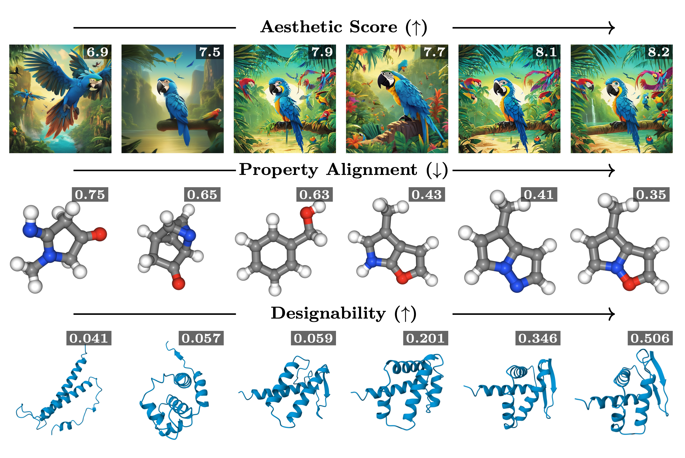
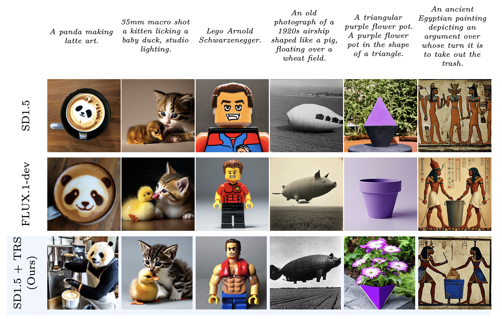
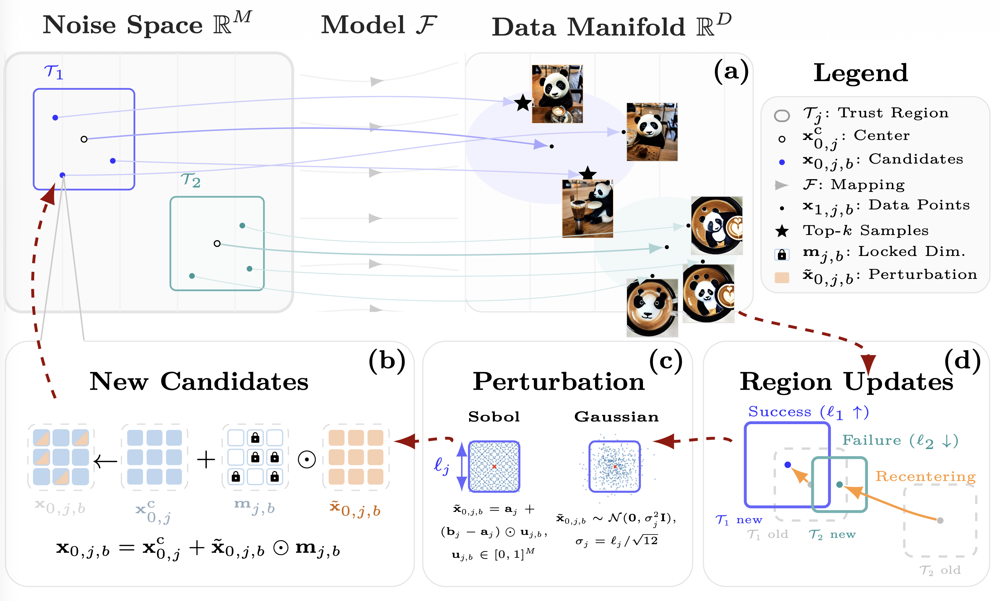
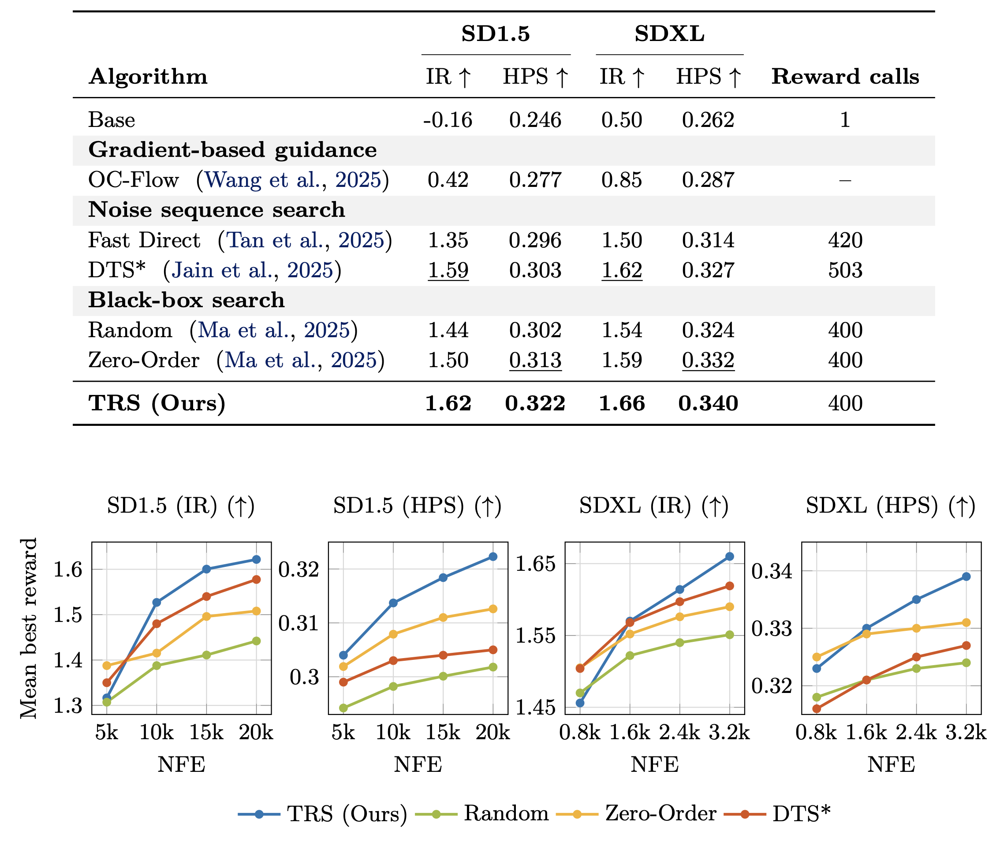
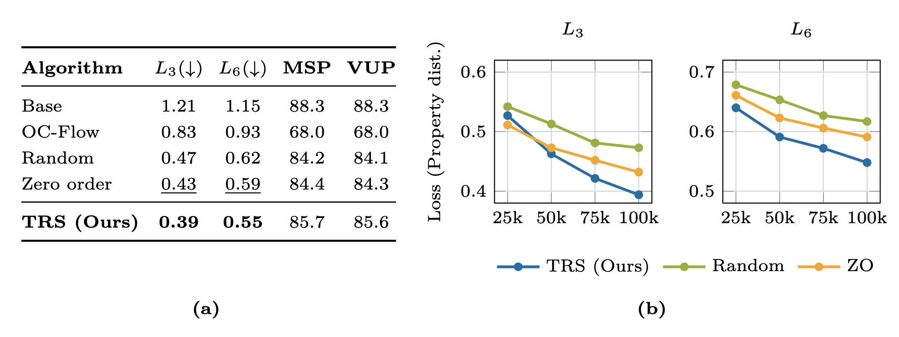
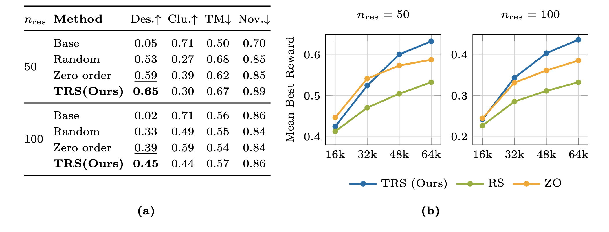
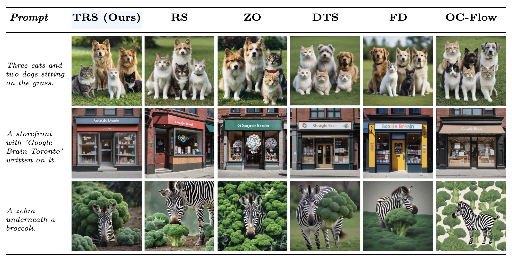
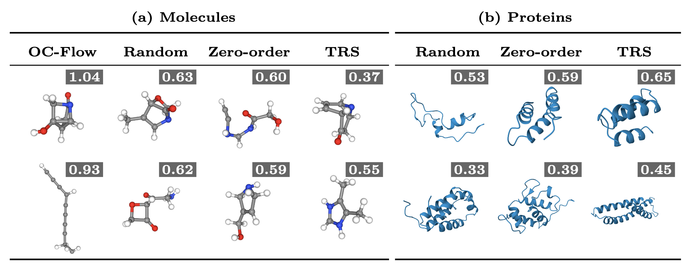

# Trust-Region Noise Search for Black-Box Alignment of Diffusion and Flow Models

[](https://arxiv.org/abs/2603.14504)
[](LICENSE)
[](https://www.python.org/downloads/)
[](https://pytorch.org/)

**[Paper (arXiv)](https://arxiv.org/abs/2603.14504)**  |  **[Project Page](https://niklasschweiger.github.io/trust-region-noise-search/#)**


> We propose **Trust-Region Search (TRS)**, a black-box optimization method that aligns pre-trained diffusion and flow models to arbitrary reward functions by searching over the source noise space.

<p align="center">
  <a href="assets/Teaser_Figure.png">
    
  </a>
</p>

<p align="center">
  <a href="assets/second_teaser.png">
    
  </a>
</p>

## Table of Contents

- [Abstract](#abstract)
- [Method](#method)
- [Results](#results)
- [Installation](#installation)
- [Configuration](#configuration)
- [Usage](#usage)
- [Reproducing Paper Experiments](#reproducing-paper-experiments)
- [Protein Diversity and Novelty Analysis](#protein-diversity-and-novelty-analysis)
- [Citation](#citation)


## Abstract

Optimizing the noise samples of diffusion and flow models is an increasingly popular approach to align these models to target rewards at inference time. However, we observe that these approaches are usually restricted to differentiable or cheap reward models, the formulation of the underlying pre-trained generative model, or are memory/compute inefficient. We instead propose a simple trust-region based search algorithm (TRS) which treats the pre-trained generative and reward models as a black-box and only optimizes the source noise. Our approach achieves a good balance between global exploration and local exploitation, and is versatile and easily adaptable to various generative settings and reward models with minimal hyperparameter tuning. We evaluate TRS across text-to-image, molecule and protein design tasks, and obtain significantly improved output samples over the base generative models and other inference-time alignment approaches which optimize the source noise sample, or even the entire reverse-time sampling noise trajectories in the case of diffusion models. 

## Method

TRS maintains a set of parallel trust regions in the source noise space. Each trust region is centered on a high-reward noise sample discovered so far. At every iteration, candidate noise vectors are sampled (via Sobol sequences) within each trust region's hypercube, evaluated through the frozen generative and reward models, and the best candidates are retained. Trust region sizes expand on successive successes and shrink on failures, balancing exploration and exploitation without requiring gradients or a surrogate model.

<p align="center">
  <a href="assets/method.png">
    
  </a>
</p>

## Results

TRS improves reward alignment across text-to-image, molecule generation, and protein design. Summary below; click an image to view full size.

| **Text-to-Image (split-screen)** | **Molecules & Protein** |
| --- | --- |
| [](assets/image_results.png) | [](assets/mol_results.png)<br><br>[](assets/protein_results.png) |

**Qualitative visualizations** — sample outputs across modalities:

| **Text-to-Image** | **Molecules & Protein** |
| --- | --- |
| [](assets/img_vis.png) | [](assets/mol_prot_vis.png) |

- **Text-to-Image:** TRS significantly improves reward alignment for Stable Diffusion 1.5 and SDXL Lightning for ImageReward and HPSv2
- **Molecules:** Simultaneously optimizing six chemical properties, TRS outperforms all baselines on the QM9 multi-property target task.
- **Protein:** TRS improves designability on unconditional protein backbone generation.

## Installation

**Requirements:** Python >= 3.10, PyTorch >= 2.5, CUDA-capable GPU recommended.

### Core install

1. Create a new environment (e.g. `conda create -n trns python=3.10` and activate it).
2. From the repository root, install the package in editable mode:

```bash
git clone https://github.com/niklasschweiger/trust-region-noise-search.git
cd trust-region-noise-search
pip install -e .
```

This uses `pyproject.toml` (the canonical source for the package and its optional extras). All core dependencies for text-to-image and QM9 molecule experiments are installed.

**Alternative (requirements file):**

```bash
pip install -r requirements.txt
pip install -e .
```

### Modality-Specific Dependencies

**Image reward models** (after core install; then install ImageReward, CLIP, and HPSv2):

```bash
pip install image-reward
pip install git+https://github.com/openai/CLIP.git  
pip install hpsv2
```

If HPSv2 fails with a missing `bpe_simple_vocab_16e6.txt.gz`, copy the BPE vocab from the CLIP package into HPSv2's `open_clip` folder (install CLIP first):

```bash
python -c "
import os, shutil
import clip
import hpsv2
src = os.path.join(os.path.dirname(clip.__file__), 'bpe_simple_vocab_16e6.txt.gz')
dst_dir = os.path.join(os.path.dirname(hpsv2.__file__), 'src', 'open_clip')
os.makedirs(dst_dir, exist_ok=True)
shutil.copy2(src, os.path.join(dst_dir, 'bpe_simple_vocab_16e6.txt.gz'))
print('Copied BPE vocab to', dst_dir)
"
```

**QM9 molecules** (required for molecule experiments):

```bash
pip install torchdiffeq rdkit
```

**Protein design** (Proteina):

We recommend a separate conda environment, but it is not strictly required if dependencies are managed carefully.

> **Checkpoints:** Download Proteina weights from [NVIDIA NGC](https://catalog.ngc.nvidia.com/orgs/nvidia/teams/clara/resources). Full setup and citation: `[noise_optimization/proteina/README.md](noise_optimization/proteina/README.md)`.

## Configuration

Before running experiments, set the following as needed. **Image-only runs need no config.**


**Proteina checkpoint** — set `ckpt_path` to the directory containing the `.ckpt` file ([download from NVIDIA NGC](https://catalog.ngc.nvidia.com/orgs/nvidia/teams/clara/resources)) in each of these four files:

1. `noise_optimization/config/modality/protein.yaml`
2. `noise_optimization/config/defaults/protein.yaml`
3. `noise_optimization/proteina/configs/experiment_config/inference_base.yaml`
4. `noise_optimization/proteina/configs/experiment_config/inference_motif.yaml`


**Optional — logging and saving**

- **Wandb:** Set `wandb_dir` in `noise_optimization/config/main.yaml` or override with `wandb_dir=/path/to/wandb_runs`. Or set env `WANDB_DIR`. Use `wandb_project`, `wandb_name` for project/run names.
- **Local outputs:** Set `save_outputs=true`, `save_outputs_dir=./my_runs`, `save_results_csv=true` to save best samples per task and a `results.csv`.

## Usage

The entry point is `noise_optimization/main.py`, configured via [Hydra](https://hydra.cc/).

### Quick Start

```bash
# Text-to-image with a single custom prompt (works out of the box)
python -m noise_optimization.main modality=image prompt="A photo of an astronaut riding a horse"
```

**Protein and QM9** require extra setup (Proteina checkpoints and/or QM9 paths); see [Configuration](#configuration) and modality-specific install above. Then:

```bash
# QM9 molecules — optimize six chemical properties simultaneously
python -m noise_optimization.main modality=qm9_target

# Protein backbone design
python -m noise_optimization.main modality=protein
```

### Solver Selection

```bash
# Trust-Region Noise Search (our method — default)
python -m noise_optimization.main modality=image solver=trs

# Baselines
python -m noise_optimization.main modality=image solver=random_search
python -m noise_optimization.main modality=image solver=zero_order
```

### Key Parameters

```bash
# Evaluation budget and batch size
python -m noise_optimization.main modality=image oracle_budget=400 solver.batch_size=20

# Override reward function or model
python -m noise_optimization.main modality=image reward_function=hps
python -m noise_optimization.main modality=image model=sdxl_lightning
python -m noise_optimization.main modality=protein reward_function=designability

# WandB logging
python -m noise_optimization.main modality=image wandb=true wandb_project=my_project
```

### Custom Prompts

To optimize a **single custom prompt** pass it directly on the command line:

```bash
python -m noise_optimization.main modality=image prompt="your prompt here"
```

To optimize over a **list of prompts** from a file, create a custom benchmark
config. Examples are in `noise_optimization/config/benchmark/`. For a text
file, one prompt per line:

```bash
# 1. Create a benchmark config, e.g. noise_optimization/config/benchmark/my_prompts.yaml:
#    _target_: noise_optimization.core.benchmarks.t2i.CustomPromptBenchmark
#    prompts_path: /path/to/my_prompts.txt   # .txt file with one prompt per line

# 2. Run with your benchmark:
python -m noise_optimization.main modality=image benchmark=my_prompts
```

Alternatively, pass a list directly via the `+benchmark.prompts` override:

```bash
python -m noise_optimization.main modality=image \
    "+benchmark.prompts=['a red car on a mountain road','a sunset over the ocean']"
```

To run only a subset of benchmark tasks (e.g. for parallel jobs):

```bash
python -m noise_optimization.main modality=image start_index=0 end_index=25
```

### Available Components


| Modality     | Models                                | Reward Functions                  | Benchmarks                              |
| ------------ | ------------------------------------- | --------------------------------- | --------------------------------------- |
| `image`      | `sd`, `sdxl_lightning`, `sana_sprint`² | `image_reward`, `hps` | `draw_bench`, `gen2eval`                |
| `qm9_target` | `equifm`                              | `multi_property_target`           | `qm9_properties`                        |
| `protein`    | `proteina`                            | `designability`                   | `protein_fixed_length` (nres=50 or 100) |


² `sana_sprint` uses [SANA-Sprint](https://github.com/NVlabs/SANA) (1.6B, 1024px, 2-step) and requires `bfloat16` support. It was not part of the main paper experiments.

## Reproducing Paper Experiments

Run from the **repository root**. Scripts use SLURM's `sbatch`; edit the `#SBATCH` headers and `activate_env()` function at the top of each script for your cluster. Without SLURM, copy the `python -m noise_optimization.main ...` command from inside the heredoc and run it directly — all Hydra overrides are visible there.

```bash
# Text-to-image: DrawBench + SDXL Lightning / Stable Diffusion
bash scripts/run_image_benchmarks.sh

# Molecules: QM9 multi-property target
bash scripts/run_qm9_target_benchmarks.sh

# Proteins: unconditional design
bash scripts/run_protein_benchmarks.sh
```

## Protein Diversity and Novelty Analysis

After running protein experiments, compute diversity and novelty of generated
structures using [foldseek](https://github.com/steineggerlab/foldseek).

**Requirements:**

- `foldseek` installed and available on `$PATH` (included in the `proteina_env`)
- A local copy of the PDB foldseek database (for novelty):
  ```bash
  foldseek databases PDB /path/to/pdb_db /tmp/foldseek_tmp
  ```

**Run the analysis:**

```bash
# Set path to your foldseek PDB database
export FOLDSEEK_DB=/path/to/foldseek/pdb_db

# Point to an output directory containing *best*_proteina.pdb files
./scripts/compute_diversity_novelty.sh outputs/proteins/prot_fix50_designability_trs_setting1_sc
```

The script computes:

- **Diversity**: cluster count / total structures (TM-score ≥ 0.5 clustering) and mean pairwise TM-score
- **Novelty**: mean maximum TM-score vs PDB (lower = more novel)

Results are reported for both all generated structures and designable-only
structures (designability > 0.1353, equivalent to scRMSD < 2 Å, matching
Proteina's evaluation protocol). A summary CSV is written to
`outputs/diversity_results/`.


## Citation

If you find this work useful, please cite:

```bibtex
@misc{schweiger2026trustregionnoisesearchblackbox,
  title         = {Trust-Region Noise Search for Black-Box Alignment of Diffusion and Flow Models},
  author        = {Niklas Schweiger and Daniel Cremers and Karnik Ram},
  year          = {2026},
  eprint        = {2603.14504},
  archivePrefix = {arXiv},
  primaryClass  = {cs.LG},
  url           = {https://arxiv.org/abs/2603.14504},
}
```


